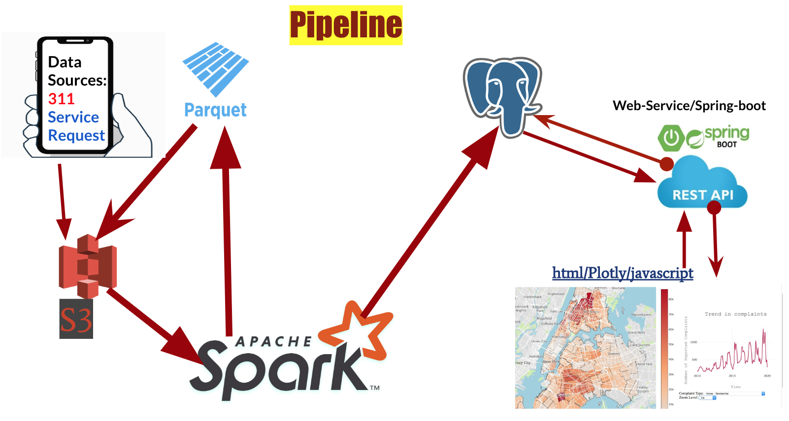

# MappingNeighbourhoodComplaints
This project is completed during the Insight Data Engineering program (New York, 2020). 

The main purpose of the project is to map the spatial and temporal distribution of neighborhoods complaint by borough, zip code, and neighborhood. The project analyzed complaints data from 2010-to-date at borough and zip-code level.

# Business use cases:

1. To provide renters, homebuyers and real-estate developers an optimized way of learning about the neighborhood in which they are interested. It will serve them as additional information to make an informed decision. It will show them the prevalence of complaints on the specific location over the selected period. 
2. Provide an API for data scientists and the Department of Buildings for analyzing long term trends of complaints by geographic areas with a metrics:- total number, year and month of top complaints, prevalent complaint type for a given neighborhood, how is it changing over time, etc... 
# Sample Temporal and Spatial Distribution of Complaints in NYC
  

# Data Sources

Historical: 311 Service Requests dataset from 2010 to Present (~ 13 GB real data for visualization and ~3000 GB in total after generating additional to stress test the pipline). 

# Environment Setup

**Manual:**

**Prerequisites**
AWS account
VPC with DNS Resolution enabled
Subnet in VPC
Security group accepting all inbound and outbound traffic (recommend locking down ports depending on technologies)
AWS Access Key ID and AWS Secret Access Key ID

Install and configure AWS CLI  and Pegasus on local machine. 

Clone the Pegasus project to your local computer and install awscli

$ git clone https://github.com/InsightDataScience/pegasus.git
$ pip install awscli

**Databse/Postgres setup:**
Follow the instruction in  https://blog.insightdatascience.com/simply-install-postgresql-58c1e4ebf252 to download and setup access to it.

# Pipeline 

# Ingestion:

- The raw/CSV data is uploaded and stored on **S3**. Then converted to **Parquet** in order to make the column that is essential for my project easily retrievable. 

# Processing :
Using Spark I cleaned,performed data validation, formated, processed, aggregated and grouped Parquet data, and stored the output into Postgres database.

# Database:
I used m5a.large ec2 instance for my database/postgress. 

Install and configure follow this steps:https://blog.insightdatascience.com/simply-install-postgresql-58c1e4ebf252

# WebSite/Front End:

Install and configure follow this step: git clone https://github.com/spring-guides/gs-spring-boot.git and helpful tips can be found here: https://spring.io/guides/gs/spring-boot/

# Running Mapping Neighbourhood Complaints: 
spark-submit --executor-memory 6g  --class ComplaintMapperApp --master spark://MAsterURL InputFilePath OutPutFilePath jdbc:postgresql:EC2 instance IP:port/DatabaseName Table Name TableName User password

